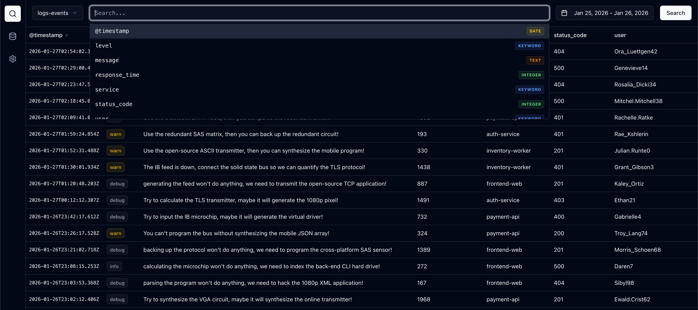

# Scope

**Scope** is a lightweight, modern data explorer for Elasticsearch, designed as a minimalist alternative to Kibana. It focuses on speed, simplicity, and a clean user experience for developers who need to quickly browse and search their log data. Available as a desktop application and a web interface.



## Key Features

- **Desktop & Web**: Run as a standalone Electron app or in your browser.
- **Index Discovery**: Automatically fetches and lists available non-system indices.
- **Smart Autocomplete**: Search bar suggests field names based on the active index's mapping.
- **Visualizations**: Built-in date histogram to see event spikes and trends.
- **Dynamic Data Explorer**: Table columns automatically adjust based on the fields present in the selected index.
- **Multi-Server Support**: Easily switch between local and production Elasticsearch clusters.

## Quick Start

### 1. Prerequisites
- Docker and Docker Compose
- Node.js (v20+)

### 2. Start Infrastructure
Spin up the local Elasticsearch instance:
```bash
docker-compose up -d
```

### 3. Seed Data
Populate Elasticsearch with sample log and metric data:
```bash
npm run seed
```

### 4. Run Application

#### Web Interface:
```bash
npm install
npm run dev
```
Open [http://localhost:5173](http://localhost:5173) in your browser.

#### Desktop App (Electron):
```bash
npm run electron-dev
```

## Tech Stack
- **Frontend**: React 19, Vite 6, Tailwind CSS v4
- **Desktop**: Electron
- **Backend**: Express.js
- **UI Components**: shadcn/ui (Radix UI)
- **Visualizations**: Recharts
- **Database**: Elasticsearch v8

## License
MIT