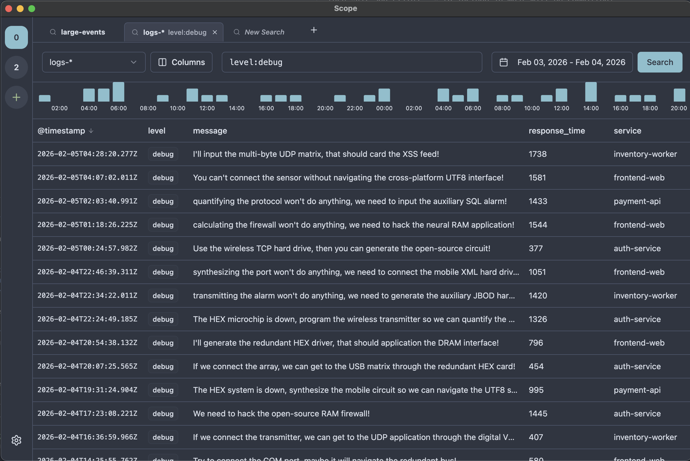

# Scope

**Scope** is a lightweight, modern data explorer for Elasticsearch, designed as a minimalist alternative to Kibana. It focuses on speed, simplicity, and a clean user experience for developers who need to quickly browse and search their log data. Available as a desktop application and a web interface.



## Key Features

- **Desktop & Web**: Run as a standalone Electron app or in your browser.
- **Index Discovery & Patterns**: Automatically fetches indices and supports custom patterns (e.g., `logs-*`) for grouping.
- **Persistent Search Tabs**: Open multiple searches simultaneously; tabs are saved across sessions.
- **Multi-Version Support**: Seamlessly connects to Elasticsearch 7.x, 8.x, and 9.x clusters.
- **Smart Autocomplete**: Real-time suggestions for field names and values.
- **Visualizations**: Built-in date histogram with automatic scaling to see event spikes and trends.
- **Column Customization**: Toggle and reorder columns with drag-and-drop to focus on relevant data.
- **Document Inspection**: Quickly view raw JSON data for any search result.
- **Multi-Server Support**: Easily switch between local, staging, and production clusters with support for Basic Auth and SSL.
- **Nord Theme**: A clean, modern UI based on the Nord color palette.

## Quick Start

### 1. Prerequisites

- Docker and Docker Compose
- Node.js (v20+)

### 2. Start Infrastructure

Spin up the local Elasticsearch instance:

```bash
docker-compose up -d
```

### 3. Seed Data

Populate Elasticsearch with sample log and metric data:

```bash
npm run seed
```

### 4. Run Application

#### Web Interface:

```bash
npm install
npm run dev
```

Open [http://localhost:5173](http://localhost:5173) in your browser.

#### Desktop App (Electron):

```bash
npm run electron-dev
```

## Tech Stack

- **Frontend**: React 19, Vite 6, Tailwind CSS v4, TanStack Query, Zustand
- **Desktop**: Electron
- **Backend**: Node.js, Express.js, Undici
- **UI Components**: Radix UI, Lucide Icons, dnd-kit
- **Visualizations**: Recharts
- **Database**: Elasticsearch (v7, v8, v9 support)

## License

MIT
